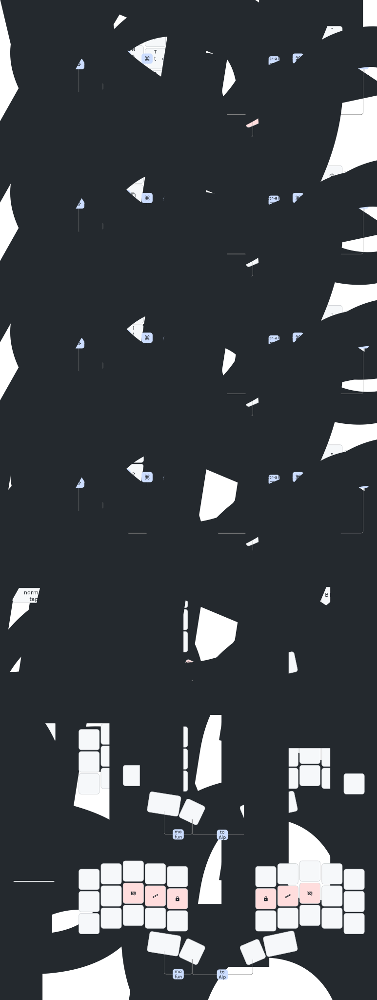

# My Keyboard Layout (aka zmk-config)

For the [Aurora Sweep](https://splitkb.com/products/aurora-sweep), a variant of the [ferris sweep](https://github.com/davidphilipbarr/Sweep), which is based on the [ferris](https://github.com/pierrechevalier83/ferris). Utilizing the cradio firmware of ZMK or QMK.

## Layout

### Status
The Lock and Danger layers don't work - but I don't need these (now).

### ZMK specific notes 
#### Splitting the ZMK-keymap-p file 
It wasn't clear to me how the keymap file can be split. Will code, starting at the root ("\ {") merge or overwrite each other? It is merging, where only blocks with the same "lable" value is overwritten. Take a look in [my definitions.dtsi file](./config/definitions/definitions.dtsi).
#### Parameters
Using C++ Macros ("#define") one can use parameters for any block. See [my definitions.dtsi file](./config/definitions/definitions.dtsi).
#### Combos with a mod-morph like key hold
With the mod-morph behavior, one key (like shift) can be hold, and then another ley pressed. This is great for alt-tab, etc. However, this is limited to specific mod keys. I wanted to use it with any key - for example for backspace: My right outer thumb key does word-backspace. Holding down the key for space/momentary layer (Symbols) is changing this key to do a normal backspace instead. Under the hood this is simply done by defining the key on the momentary layer to the alternative press (the backspace).
#### Tap Dance
I first had shift implemented as a double-tap. However, the keyboard felt very slow - letters where coming late to the screen. This is because the leyboard-fw waits for either a time-out or another letter to be pressed. This might be ok for a fast typer - but not seeing the pressed letter immediatly makes me typing slower instead. I abandoned tap-dances completely.

## Design Decissions
### Chording
The basis idea of this layout is using chords. This term comes from stenographers at, e.g., a law court: By pressing keys simultaniously, pre-defined words will be written. Under the hood I am using ZMK's macros, to define the words to be written, and combos, to define the keys to be pressed. Take a look at [my chord definition](./config/chording/chords.dtsi).  
As I was afraid of accidentally executing chords, I assigned the right inner thumb key to be hold to be able to execute chords. Under the hood, this switches to an empty layer. Only here the chords are active.  
Thus, the key positioning in the base layer doesn't matter much - any hard to write word can be a combo.  
I took the basis idea from [the characoder](https://www.charachorder.com/en-ch) and [dilip's blog post](https://dlip.github.io/posts/hybrid-keyboard-chording-with-zmk/) (n.b.: dilip's implementation for ZMK doesn't work anymore. As he switched to QMK, he is not supporting it.).

### Layout
#### Layer Alpha
The base layout is taken from [Hands Down Neu](https://sites.google.com/alanreiser.com/handsdown/home/hands-down-neu) with these changes:
- Q (actually qu and with shift Qu - when I need just 'q' I need to backspace) as a chord on W * F (left upper row pinky and ring finger).
- J on the Q position ... why are they 6 keys on the right side in the upper an middle row?
- ' and " as shift on the same key - I don't have 6 keys here either
- removed the punctuations from the thumb keys to shift/symbol of the '.', ',' and '/' keys.
- Thumbs (from right to left):
    - Return is on the rightmost thumb.
    - Space is on the next thumb to the left.
    - Backspace is on the next key on the left side. This is actually Backspace-Word - as when learing tyoing it is better to delete the whole word. The normal backspace is enabled when holding the thumb key on the right simultaniously. This is not a chord, but a key on the symbols layer - so the momentary layer key can be hold nad the backspace key can be tapped multiple times for each word to delete.
    - A repeat key is on the leftmost thumb key.
A key idea of *hands down neu* is that vocals and consonants are on separate hands, to have more switch hands key presses.
I was considering [Colemark](https://en.wikipedia.org/wiki/Colemak) and [ISTR](https://www.reddit.com/r/KeyboardLayouts/comments/qme0w7/thoughts_on_isrt/), which is [Ben Vallack's](https://www.youtube.com/results?search_query=ben+vallack+keyboard) prefered layout.
But, like Ben said - the layout doesn't matter much. Pick one, learn it - and stick with it. They are much better than querty - but the benefits from one over the other are dismissingly small.
And using Chords reduces the optimisation of the layouts even more: They are optimised for the most common words - and having them as chords, I don't need to type them.
##### Auto-Shift
The punctuation keys add a space and hold shift pressed for another 10 seconds.  
Tap-dance double-tap for shift added a delay on the first tap, which slowed down my typing.
Hold for shift would slow down my typing as well - and conflict with HRM.
Having Shift on the home row works quite well!
##### Home Row Mods
I contemplated a toggle key to switch on [home row mods](https://zmk.dev/docs/behaviors/hold-tap#example-use-cases). However, I did not find a way of implementing this which works with keeping the mod key hold and press another key. Having them on a dedicated layer with the mod keys requires leaving the layers. Thus, the mod keys can't be held (though I did not test it - and a reddit entry suggested that it might work).

I found a solution in a [timeless setup](https://github.com/urob/zmk-config#timeless-homerow-mods): one that minimizes accidental mod activation through setting hold-tap properties in a way the timing doesn't matte much.  
The left HRM-keys are ment to enable the right side alpha keys and vice versa. Only when held for a longer time, the HRMs work on their own side (if I need to activate them single handed).  

I am using HRMs in the alpha layer, the symbol layer (only on the right side, as hold actions on the left are reserved for closing brackets) and on the command layer (to modify the commands).
I don't need them on the numbers and functions layer.
##### Caps Word
Chord on both shift keys for Caps-Word works very well.
##### Special Characters (German)
They only special letters I need are ä, ö and ü - and very seldom ß. These I get with combos of the letter and 'e'. Ö is hard to execute - needs a press of two letters with the middle finger ... but the 'you' trigram on the letters beats having the 'o' relocated. I might tyoe 'you' more often to 'ö'.

#### layer switching
Are all on the base key. I decided for momentary layers - meaning the layer is active only if the key is held pressed.  
The switches for symbols and numbers are on the left thumb keys. This is so that these can be used single handed - while the right hand operates the mouse.  
The rightmost left thumb key is the resting position - so the more used symbols layer switch is here. As these are momentary layer switches, I implementing them with hold actions works quite nice.  

Switching to the function keys layer is done by pressing the two left thumb keys together. Again, so that they can be used single handed. 

The right thumbs switch to the chording layer (which is like using a shift key to enable chords) and the command layer, which enables command switches like media keys (e.g. volume control) and OS actions (e.g. switch apps).  
These do not need (so much) to be used single-handeled.  
I assume (more: I should) use chording more than commands - thus their enabler is on the easier to reach thumb key.

#### Symbol layer
(weak) marks a key position which is not placed optimal or very logical.  

The symbols are placed as logical as possible.
Punctuations are on the same ley, tab, shift-tap and sym-(layer)-tap:
- ',', ';' and '?', all "round" punctuations
- '.', ':' and '!', all "line" punctuations
- '/', '|' and '\', all "slashes"
- ''', '"' and '`', all "tickmarks"
- '-' and '_' are on the same key. '-' is mapped for the symbols and numbers layer as well, on the same key.
- '@' on 'A' for 'at'
- '=' on 'E' for 'equals'
- (weak) '&' on 'I' - as 'A' is taken - for i (and in Serbian. 'y' is and in Spanish - as an alernative)
- '#' on 'H' for 'hashmark'
- (weak) '€' on 'U' - as 'E' is taken. This is the same finger as for '$' on the left side.  

The left hand side symbols are to be used with one hand only - while the mouse is on the right hand. That is mostly the brackets - as the mouse might be used to position the cursor.
These are on the home row:
- '[ { ( <' are the opening brackets, '(' as the most commen on the index finger.
- the closing counterparts ('] } ) >') are either reachable with shift - or on a key hold. I will see if key-hold (aka auto-shift) is working good enough.
- '$' is on 'D'
- (weak) '^' is in the upper right corner ... as it points upwards. 
- (weak) Under it is 'forward delete'. This is a easy to reach key, for with no bracket is left.
- (weak) Under this is 'INSERT' - with the only reason to be close to 'forward delete'.  
I might replace these keys with other symbols - as I might never use them.
However, there are more keys empty for future symbols.

On the left side top row I placed the arrow keys for navigation. when using them I would not use the mouse - so they could be on the right side as well. However, the top row is not free enugh (due to the punctuation keys) and the lower row is harder to reach.

#### Numbers Layer
Similar to the symbols layer, the numbers should be usable single handed.
All numbers are on the left side: 
- 1, 2 and 3 in the middle row, in reverse, so that 1 is on the index finger. 
- The highest numbers, 9, 8 and 7, are on the highest row, the rest in the buttom row. 
- 0 on the middle rightmost.
- the separators, '.' and ',', are right-top and bottom.
- the leftmost (pinky) column is for simple math:
    - '+' and with shift '-' is in the middle row, as these are the calculations I use most,
    - '*' and with shift '/' in the top row, second most used,
    - '=' and with shift '^' in the bottom row.
The right side has some more math symbols, I use less frequent:
- (weak) '§' on the '?' key, as it looks round as well
- (weak) '%' on 'A'. On the index finger, as I might use this most often from the right hand symbols.
- '≤' or 'E', which hold '=' on the alpha layer.
- '≥' next to it, as it is bigger.
- '#' again on the 'H' key.
In the upper row:
- (weak) ''' as it is a line and a separator as well, so it is opposite to ',' as another separator
- (weak) '!' on the next key, same position as alpha+shift.
- nothing on the next key.
- (weak) '°' on the key, where '"' is in alpha. 
- '∑' on Z, as it looks similar
And in the buttom row:
- '_' leftmost, same posotion as on alpha.
- 'µ' on 'U' (as 'M' is taken - but 'U' is good enough) 
- (weak) '±' 
- (weak) '≈'
- (weak) '≠'
The last three keys don't have a good reason to be there - except for being close together as they have related meanings.
#### Function keys layer
Optimised for one-handed use. However, not arranged like the number keys, as the placement of the F-keys over F9 would be not very logical. Starting from the right-upper corner of the left side, they go from F1 down to F15.
Apples keyboards just have keys until F12 - but the OS supports keys until F19! Might be useful for custom shortcuts.  
The right side has the remaingin keys F16-F19 on the home row, with having nothing on the leftmost key.
In the upper row are the bluetooth channel select keys, from left to right for Channel 1 ot 5 (ZMK doesn't support more).
I combined the channel switching with switching the led color, so that the current channel can be seen like this (as it is not shown on the display).  
In the lower row, from left to right, there is a key for
- resetting the bluetooth connection [BT_CLR](https://zmk.dev/docs/behaviors/bluetooth#bluetooth-command-defines)
- prefer the bluetooth connection [OUT_BLE](https://zmk.dev/docs/behaviors/outputs#output-command-defines) (ZMK's default setting)
- prefer the USB connection [OUT_USB](https://zmk.dev/docs/behaviors/outputs#output-command-defines)
The last two keys in the lower row activate the danger layer as long as they are hold.
It is by intention that they are on a hard to reach position.

#### Commands layer
These are OS level commands.
In the middle row, on the left side (for having the mouse in the right hand) are the most common used commands:
- 'paste' on the index finger home position,
- 'paste history' on it's right side
- 'copy' on the middle finger
- 'cut' on the ring finger. This order is the same as on a querty keyboard.
- 'select all' is on the next best-to-reach key, the middle row pinky position.
In the upper row are the next most useful functions:
- 'switch apps' on the top row outer index finger position.
- 'switch windows of one app' in the same column, bottom row. This is less often used.
- 'undo' in the top row, index finger - as it is quite frequently used. The backspace position would be an alternative - but 'redo' would not pair nice (and a thumb button combination would be wasted)
- 'redo' next to it.
- 'find' on the 'F' key
- 'find all' next to it and above
- 'select all', which is on the pinky in the middle row. This is often followed by 'copy'.
In the buttom row we can find:
- (weak) 'tab' on the index finger. 'T' is taken, thisi s right below that key. Maybe I need a better position for this frequently used key.
- (weak) 'Enter' on the ring finger position. I might not need this key - or can do it with 'fn & RETURN'
- 'find next' and 'find prev' on the leftmost positions in the lower row. Only, because they are together here and because the find keys are all more on the left side. After 'find' I use 'find next' most, which is in the same column.
On the right side:  
The top row controls the media keys, from leftmost to rightmost:
- volume down, mute, volume up
- brightnes down, brightnes up
In generall, all 'negative' actions are left from the 'positive' actions (see redo/undo, navigation down/up, ...)
The middle row moves the window positions.
- leftmost: move window one desktop (aka Space) to the left
- rightmost: move window one desktop (aka Space) to the right
- index finger position: move window to the left half/third of the screen
- middle finger position: move window to the middle third of the screen
- ring finger position: move window to the right half/third of the screen
While moving a windo through spaces, the last the commands are only possible through my configuration in BetterTouchTool.

In the bottom row:
- (weak) leftmost is the ESC key.
- (weak) next to it the 'previous media' key
- (weak) next the 'play/pause' button
- (weak) next the 'next media' button
The last three buttons are in a logical order. But otherwise this placement is quite random.
The last key position is not used.

#### Danger layer
The danger layer, which is activated in the function layer, and thus requires holding both left thumb keys and the right side rightmost bottom row keys (intentionally asymetrically and hard to reach).  
Here are two chords:
- 'sys reset' is resetting the keyboard, and requires pressing both middle row outer index keys. This can be triggered by pressing the reset button *once* as well.
- 'bootloader' is setting the keyboard to bootloader mode so a new firmware image can be flashed.  It is activated by pressing both index finger home positions simultaniously. This can be triggered by pressing the reset button *twice* as well.

Currently this key combinations seem not to work. However, I don't really need them, as I can do the same with the reset button.

#### Lock layer
In this layer all key presses do nothing - except a combo to return to the alpha layer. This is useful to deactivate the keyboard so it doesn't accidentally switches on while packed in a rucksack.
The combos are only active in the Function key layer (although they are definded in the lock layer file), thus require both left thumb keys to be pressed.  
They are executed by simultaneously pressing the opposite keys in the home row:
- both ring finger keys to lock the keyboard - which is under the hood a layer toggle to the lock layer.
- both index finger hoome position keys, to send the host computer to sleep,
- both index finger outer keys, to lock the host computer.

Currently none of these are working! While the OS sleep/lock keys might not be supported by MacOS, the layer toggle should work. Maybe it is conflicting with another chord.
However, I don't rally need those. For transport I have the hardware-off switch. Locking the keyboard with the lock layer hack is still activating it and thus draining power.

# How To ...
## build
### remote (prefered)
in github -> actions -> run workflows -> build
### local
Download ZMK/app, and within this folder:
west build -b nice_nano_v2 -- -DSHIELD=pats_left -DZMK_CONFIG="./config"

## flash
1. press the reset button twice -> nice!nano mounts as folder
2. copy each uf2 to each half
3. wait until the drive unmounts itself (OS complains of unclean removal, but that is no problem)

# Misc
## files

config/info.json:       layout for visual editors  
config/visualisation/:  files to visualize the layout 

## editors
Best, plantUML like:  
- webapp https://caksoylar.github.io/keymap-drawer
- CLI https://github.com/caksoylar/keymap-drawer
### install with:
1. brew install pipx
2. pipx install keymap-drawer
3. pipx ensurepath

### online only

https://nickcoutsos.github.io/keymap-editor/ - an editor, which works with .keymap files. However, it doesn't show all layers at once.

http://www.keyboard-layout-editor.com/#/gists/07709e4831a3a660797160b0fc885558 - shows all layers in one picture - but doesn't work with keymap files directly

Or:
For QMK:
https://config.qmk.fm/#/ferris/sweep/LAYOUT_split_3x5_2
Convert to ZMK:
https://aaronsantiago.github.io/qmk-to-zmk/

## inspiration / credits
- https://dlip.github.io/posts/hybrid-keyboard-chording-with-zmk/
- https://github.com/rayduck/pnohty
- https://www.charachorder.com/en-ch
- https://www.youtube.com/results?search_query=ben+vallack+keyboard
- [timeless setup](https://github.com/urob/zmk-config#timeless-homerow-mods)